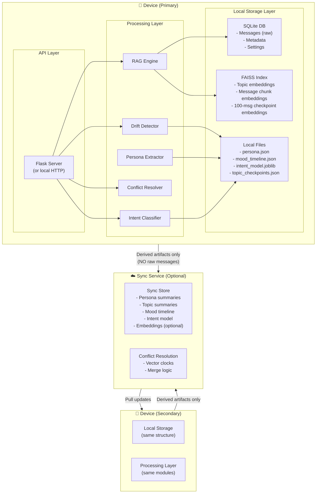

# System Design — On-Device Conversational AI Assistant

## Overview

This document describes the sync architecture for an **on-device personal AI assistant** that processes private conversation data. The design prioritizes **privacy** while enabling multi-device usage.

---

## Architecture Diagram



---

## Storage Design

### On-Device: SQLite + FAISS + Files

| Store | Contents | Format | Size (est.) |
|-------|----------|--------|-------------|
| **SQLite** | Raw messages, metadata, conversation index, settings | Relational DB | ~50-200MB |
| **FAISS** | Topic embeddings, message chunk embeddings, checkpoint embeddings | Binary index files (.bin) | ~5-10MB |
| **JSON files** | persona.json, topic_checkpoints.json, mood_timeline.json | JSON | ~50-100MB |
| **Model files** | intent_model.joblib, ONNX embedding model | Binary | ~35MB |

**Why SQLite over raw JSON for messages?**
- Supports indexed queries by conversation_index, speaker, global_index
- ACID transactions prevent data corruption on crash
- Can handle 200K+ messages efficiently with proper indexing
- JSON files remain for derived artifacts (personas, timelines) — these are write-once, read-many

---

## Sync vs. Local — Privacy-First Boundary

### 🔒 STAYS LOCAL (Never Synced)

| Data | Reason |
|------|--------|
| **Raw messages** | Private conversation content — highest sensitivity |
| **conversations.csv** | Source data — contains all raw text |
| **messages.json** | Parsed messages — still contains full text |
| **FAISS message chunk index** | Embeddings can theoretically be reversed to approximate original text |

### ☁️ SYNCS (Derived Artifacts Only)

| Data | Reason | Conflict Strategy |
|------|--------|-------------------|
| **Persona summaries** | Aggregated traits, no raw quotes | CRDT merge (additive) |
| **Topic checkpoint summaries** | High-level topic labels, no raw messages | Last-write-wins |
| **Mood timeline** | Aggregated mood scores per day, no text | Last-write-wins |
| **Intent model** | Trained on synthetic data, no user content | Version-based (latest) |
| **Embeddings** (optional) | Only if user opts in; 384-dim vectors are hard to reverse | Append-only |

### Justification

The boundary is drawn at **information reversibility**:
- Raw text → directly reveals private conversations
- Persona traits (e.g., "enthusiastic: 0.92") → aggregated statistic, cannot recover original messages
- Topic labels (e.g., "Cooking & Pets") → high-level category, no private content
- Mood scores (e.g., "valence: 0.45") → numerical aggregate, no text

This follows the principle of **data minimization**: sync only what's necessary for a consistent cross-device experience.

---

## Cross-Device Conflict Resolution

### Strategy: Hybrid — Vector Clocks + CRDT-like Merge

#### 1. Persona Updates (CRDT Merge)

Persona data is **additive** — traits are discovered over time, not overwritten:

```
Device A discovers: {trait: "enthusiastic", score: 0.85, evidence_count: 120}
Device B discovers: {trait: "enthusiastic", score: 0.90, evidence_count: 150}

Merge result: {trait: "enthusiastic", score: 0.90, evidence_count: 150}
              (take higher evidence_count → more data = more accurate)
```

For **new traits** discovered on different devices: union merge (add both).
For **conflicting scores** on same trait: take the version with more evidence (higher evidence_count wins).

This is a **G-Counter / LWW-Element-Set CRDT** pattern — it guarantees convergence without coordination.

#### 2. Topic Checkpoints (Last-Write-Wins with Timestamps)

Topics are generated from raw messages that stay on-device. If both devices process the same data:
- **Identical input → identical output** (deterministic pipeline)
- **Different input** (device-specific messages) → each device's topics are kept; merged timeline on sync

Conflict: If both devices regenerate topics from the same data independently, **last-write-wins** using wall-clock timestamps (ISO 8601 with timezone). This is acceptable because topic detection is deterministic — the same input produces the same output.

#### 3. Mood Timeline (Append-Only + Last-Write-Wins)

- New days are appended (no conflict — each day is unique)
- If both devices analyze the same day: LWW (the analysis is deterministic, so results should match)

#### 4. Settings & Preferences (Vector Clocks)

For user-tunable settings (drift threshold k, recency/emotional weights):
- Each device maintains a vector clock `{device_id: counter}`
- On sync, compare vector clocks:
  - If one dominates → take that version
  - If concurrent → present conflict to user or use most-recent timestamp

---

## Explicit Trade-offs

| Decision | Pros | Cons |
|----------|------|------|
| **Raw messages stay local** | Maximum privacy; no server breach risk; GDPR/CCPA compliant | No message search across devices; must re-process if device lost |
| **SQLite for messages** | Fast indexed queries; ACID; proven at scale (WhatsApp uses it) | Single-writer limitation; not distributed-friendly |
| **FAISS for embeddings** | Fast CPU-based similarity search; memory-mapped files | No built-in distributed support; must rebuild index on new device |
| **CRDT for persona merge** | Automatic convergence; no coordination needed; works offline | Monotonically growing (traits only added, never removed); eventual consistency delay |
| **LWW for topics** | Simple; deterministic pipeline makes conflicts rare | Theoretically loses data on true concurrent writes (rare in practice) |
| **Sync derived artifacts only** | Small sync payload (~1-5MB); privacy-preserving | Cross-device RAG search is limited to summaries (no full-text search across devices) |
| **Local embedding model (~30MB ONNX)** | Offline; no API costs; reproducible | Larger model (e.g., E5-large) would improve retrieval quality |
| **TF-IDF intent classifier (<2MB)** | Instant inference; tiny; fully offline | Less accurate than fine-tuned BERT; struggles with nuanced intents |
| **vaderSentiment for mood** | Rule-based = deterministic & explainable; no GPU needed | Less accurate than transformer-based sentiment; English-only |

---

## Alternative Designs Considered

### 1. Full Cloud Sync (All Data)
❌ **Rejected**: Privacy risk — one breach exposes all conversations. Also requires constant connectivity.

### 2. End-to-End Encrypted Sync
⚠️ **Considered**: Would allow syncing raw messages safely, but adds significant complexity (key management, re-encryption on device change). Could be a V2 enhancement.

### 3. Federated Learning for Persona
⚠️ **Considered**: Train persona model across devices without sharing data. Overkill for 1-2 devices; would be valuable at scale (e.g., family shared assistant).

### 4. CouchDB / PouchDB for Sync
⚠️ **Considered**: Built-in conflict resolution and offline-first sync. Good option but adds a dependency. SQLite + custom sync is lighter for our use case.

---

## Deployment Topology

```
Single Device (Default):
  [SQLite + FAISS + Files] → [Flask API] → [Browser UI]

Multi-Device (Optional):
  Device A ←→ [Sync Service] ←→ Device B
         ↕                              ↕
  [Local SQLite]                [Local SQLite]
  [Local FAISS]                 [Local FAISS]
```

The sync service can be as simple as an S3 bucket with versioned JSON files, or a lightweight REST API with timestamp-based conflict resolution.
